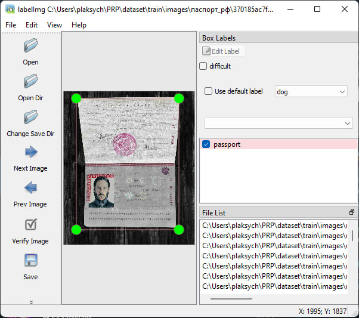

# PRP - Passport Recognition Project

проект распознавания изображений паспортов

## Задачи

- написать скрипт: скачивание фотографий по запросу "паспорт РФ"
- реализовать распознавание изображений по признаку "есть паспорт" или "нет паспорта"
- реализовать хранение обработанных данных с признаком

## Реализация

### Скрипт-скрапер

#### Инструменты

- python
- selenium

#### Описание

- Датасет состоит из 100 изображений по запросу 'паспорт рф' и 100 изображений по запросу 'картинки' в dataset/val
- Для обучения модели отбирается половина изображений 50 c Sпаспортом или обложкой и 50 картинок в dataset/train

### Распознавание

#### Инструменты

- yolo model recognise
- LabelImg

#### Fixing issues with labelImg:

- cd \venv\Lib\site-packages
- git clone https://github.com/HumanSignal/labelImg.git
- pip install -e labelImg
- pyrcc5 -o libs/resources.py resources.qrc

#### Разметка тренировочного датасета в labelImg:



#### Yolo model

##### Подготовка данных

После разметки изображений вам нужно будет подготовить данные для обучения:
Соотношение train-validation должно быть 80%-20% причём val - объекты которые модель не видела при обучении.

- Убедитесь, что у вас есть соответствующая структура каталогов. Пример:
    ```
    dataset/
        train/
            images/
                img1.jpg
                img2.jpg
                ...
            labels/
                img1.txt
                img2.txt
                ...
        val/
            images/
                img3.jpg
                ...
            labels/
                img3.txt
                ...
    ```

- Создайте файл `classes.txt`, который будет содержать названия ваших классов.
    ```
    passport, cover, other
    ```

#### Обучение модели YOLO

Теперь, когда у вас есть разметка и структура данных, вы можете начать процесс обучения.

1. **Скачайте предобученные веса YOLO**. Лучше всего использовать вариант YOLOv5 или YOLOv7, так как они совместимы с PyTorch и имеют более простые возможности для обучения на собственных данных.

2. **Установите необходимые библиотеки.** Например, для использования YOLOv5:
    ```bash
    git clone https://github.com/ultralytics/yolov5.git
    cd yolov5
    pip install -r requirements.txt
    ```

3. **Настройка конфигурации.**
   Вам нужно создать файл конфигурации `config.yaml` для вашей задачи.

4. **Обучение модели.**
   Используйте файл main.ipynb для запуска обучения модели
   Параметры обучения модели:

   - `--img`: Размер изображений, на которых вы будете обучаться.
   - `--batch`: Размер пакета.
   - `--epochs`: Количество эпох обучения.
   - `--data`: Укажите путь к вашему `.yaml` файлу.
   - `--weights`: Используйте предобученные веса. Вы можете выбрать различные версии модели (например, `yolov5s.pt`, `yolov5m.pt` и т.д.).

#### 5. Тестирование и оценка модели

После завершения обучения вы можете протестировать модель на новых изображениях, чтобы убедиться, что она распознает паспорта.
Для этого запустите второй блок main.ipynb указав путь к файлу для распознавания.

#### 6. Использование обученной модели

Как только вы получили модель, вы можете использовать `detect.py` для распознавания объектов в новых изображениях. Например:
```bash
python detect.py --weights runs/train/exp/weights/best.pt --img 640 --conf 0.25 --source path_to_your_image.jpg
```